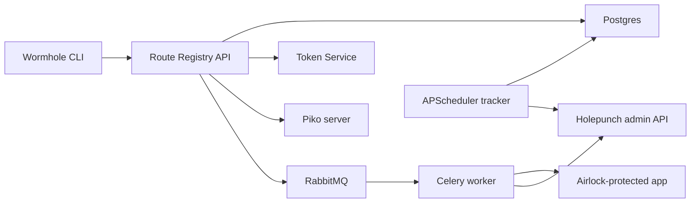

# Route Registry

Route Registry is the Wormhole service that records routes, validates app
authorization metadata, and returns the connection details needed to reach apps
through Piko and Holepunch.

## Table of Contents

- [Description](#description)
- [How Route Registry Fits Into Wormhole](#how-route-registry-fits-into-wormhole)
- [Configuration](#configuration)
- [Deployment](#deployment)
- [Development](#development)
- [API and Workflow Notes](#api-and-workflow-notes)
- [Testing](#testing)
- [Developer Notes](#developer-notes)
- [Governance](#governance)

## Description

Route Registry is a Python FastAPI service that maps public Wormhole route names
and URLs to target tunnel endpoints with authorization metadata. It registers
routes for the Wormhole CLI, fetches and validates app-served
`/-/airlock/authz.json`, stores route/community/domain/user/group state, issues
Piko JWTs for tunnel access, and notifies Holepunch when route state changes.
Major dependencies include FastAPI, SQLAlchemy, Alembic, Dynaconf, Celery,
RabbitMQ, APScheduler, Authlib, cryptography, bcrypt, jsonschema, psycopg2, and
fastapi-offline.

The code uses a layered service architecture. `route_registry/command.py`
provides the CLI entry point for `run`, `listen-tasks`, `openapi`, and
`generate-jwks`; `route_registry/server.py` assembles FastAPI routes and
dependencies; `route_registry/routers` contains public and administrative API
routers; `route_registry/models.py` defines attrs-based domain objects;
`route_registry/pydantic_models.py` defines wire schemas; `route_registry/store`
and `route_registry/service/uow.py` implement SQLAlchemy repositories and unit
of work; `route_registry/services.py` contains domain workflows; and
`route_registry/celery.py` plus `route_registry/track.py` handle async route
validation and periodic status tracking.

Within Wormhole, Route Registry is the control-plane service that tells the CLI
and gateway how a named app should be reached. A route registration returns the
public Wormhole URL, the Airlock/Token Service JWT issuer URL, the Piko tunnel
connect URL, a route endpoint ID, and a signed Piko JWT. Holepunch consumes this
route state to configure Envoy, and Token Service/JWKS are used to authenticate
users and automated callers.

## How Route Registry Fits Into Wormhole



The service bridges user-facing route creation and operator-facing gateway
state. It owns route metadata and validation, while Holepunch owns active proxy
behavior.

## Configuration

Route Registry uses Dynaconf. Defaults live in
`route_registry/config/settings.toml`; local overrides can be supplied with
`settings.toml`, `settings.local.toml`, `.secrets.toml`, or `DYNACONF_*`
environment variables.

Important configuration groups include:

| Group | Purpose |
| --- | --- |
| `server` | FastAPI host, port, and loop settings. |
| `db` | SQLAlchemy database URL and credentials. |
| `celery` | RabbitMQ broker and result backend configuration. |
| `auth` | Admin auth, JWT/JWKS, Token Service, and optional OIDC session auth. |
| `url` | Public entry URL, Piko tunnel URL, Token Service URL, and Holepunch admin URL. |
| `track.routes` | Route status check interval and stale-route threshold. |

Generate per-environment JWKS material rather than reusing local files:

```shell
uv run route_registry generate-jwks --write-settings --overwrite
```

This creates `jwks/private.pem`, `jwks/public.pem`, `jwks/kid.txt`, and a local
settings override when requested. Treat generated private keys as secrets.

## Deployment

### OpenShift and Helm

Production and development deployments are CI/OpenShift/Helm based. The parent
chart in `helm/route_registry` deploys:

- `route-registry-core`: FastAPI API service.
- `route-registry-worker`: Celery worker for route validation tasks.
- `postgres`: database stateful workload.
- `rabbitmq`: broker for Celery tasks.

The core image starts the API with OpenTelemetry instrumentation. The worker
image starts `route_registry listen-tasks`. The core deployment runs an init
container that executes `scripts/migrate-db`, which waits for Postgres and runs:

```shell
alembic upgrade head
```

Required runtime secrets include:

| Secret | Purpose |
| --- | --- |
| `postgres-credentials` | Supplies `POSTGRESQL_USER` and `POSTGRESQL_PASSWORD` to the API and migration container. |
| `rabbitmq-secret` | Supplies `rabbitmq-username` and `rabbitmq-password`. |
| `route-registry` | Supplies sensitive Dynaconf values such as auth/JWT/OIDC/admin secrets. |

Manual deployment from `route-registry/helm/route_registry` follows the normal
Helm pattern:

```shell
helm upgrade --install route-registry . -f values.yaml
```

CI validates, publishes, builds the API and worker images, copies images into
OpenShift, deploys pre-production automatically for new versions, and deploys
production manually.

### Local Database

Local development can use SQLite for basic API work, but use Postgres whenever
creating, testing, or reviewing Alembic migrations.

Start a local Postgres instance with Podman:

```shell
podman run --name some-postgres \
  -e POSTGRES_PASSWORD=secret \
  -p 5432:5432 \
  -d postgres:16.10
```

Update `settings.toml` or `settings.local.toml` with the local database URL and
credentials as needed.

## Development

Requirements:

- Python 3.11 or newer
- [uv](https://docs.astral.sh/uv/)
- Postgres for migration work
- RabbitMQ for worker and e2e flows

Create a local environment and install the package:

```shell
uv venv
uv pip install -e .
```

Run the API:

```shell
uv run route_registry run --host localhost --port 5001
```

Run the Celery worker:

```shell
uv run route_registry listen-tasks
```

Run migrations:

```shell
uv run alembic upgrade head
```

Generate OpenAPI:

```shell
uv run route_registry openapi
```

### Local Dev Authentication

Most endpoints require an authenticated user, which normally means standing up
an external identity provider. For local development there is a `local_dev`
authenticator that skips authentication entirely and resolves every request to
a single seeded user.

**This is for local development only.** It accepts no credential and verifies
nothing; never enable it anywhere else.

Seed the user (defaults to your machine username, idempotent):

```shell
uv run wormhole_route_registry seed-dev-user
```

Then start the server with the authenticator enabled:

```shell
DYNACONF_AUTH__auth_name=local_dev uv run wormhole_route_registry run
```

Or do both in one step -- `make run-dev` seeds the user and starts the server
with `local_dev` auth already enabled:

```shell
make run-dev
```

Every API call now authenticates as that user, with no header, cookie or token:

```shell
curl http://localhost:5001/api/v1/community
```

Options:

- `--uid <uid>` seeds a specific user instead of your machine username.
- `--admin` / `--no-admin` control admin rights; re-running reconciles the flag
  on an already-seeded user. Defaults to `auth.local_dev.is_admin` (`true`).
- Exporting `LOGNAME=<uid>` makes both the command and the authenticator act as
  another seeded user, which is handy for testing non-admin behavior.

Rather than setting the environment variable on every run, you can opt in from
`settings.local.toml`, which is not checked in:

```toml
dynaconf_merge = true

[default.auth]
auth_name = "local_dev"

[default.auth.local_dev]
uid = ""        # defaults to the local machine username
is_admin = true
```

The default `auth_name` in `route_registry/config/settings.toml` stays
`base_auth` -- do not change it there.

### Common Commands

A `Makefile` wraps the commands above:

| Target | What it does |
| --- | --- |
| `make sync-dev` | Install the dev environment |
| `make sync-prod` | Install from the lockfile, without dev dependencies |
| `make test` | Run the test suite under tox |
| `make seed` | Seed the local dev user |
| `make run-dev` | Seed, then run the API with `local_dev` auth |
| `make listen-tasks` | Run the Celery worker (needs RabbitMQ) |
| `make migrate` | Apply alembic migrations |
| `make jwks` | Generate local JWKS and `settings.local.toml` |
| `make openapi` | Write `openapi.json` |
| `make lock` / `make lock-check` | Regenerate / verify `uv.lock` |
| `make build` | Build the wheel into `dist/` |

`HOST` and `PORT` override the bind address: `make run-dev PORT=8001`.

## API and Workflow Notes

Important workflows:

- Register a route: the API creates or updates route state, validates
  authorization metadata, and returns public URL plus Piko tunnel details.
- Validate route authorization: the worker fetches the app-served
  `/-/airlock/authz.json`, validates it against the configured JSON schema, and
  stores resulting allow/deny rules.
- Refresh Holepunch: route validation and tracking workflows call Holepunch
  admin endpoints so the gateway can refresh cached route state.
- Authenticate callers: dependencies support admin header auth, Token Service
  token exchange, route JWT rotation, and optional OIDC session auth.
- Manage communities: community routes allow shared policy and subtoken behavior
  across related routes.

The API is versioned under paths such as `/api/v1`, `/api/v2`, `/api/latest`,
and `/api/stable`.

## Testing

Run lint checks:

```shell
uvx tox -e lint
```

Run non-e2e tests:

```shell
uvx tox -- -m "not e2e"
```

Run e2e tests:

```shell
uv run route_registry generate-jwks --write-settings --overwrite
uvx tox -- -m e2e
```

E2E tests need live supporting resources such as RabbitMQ and generated local
JWKS/settings. Tox delegates to `pytest`, so specific tests can be selected with
normal pytest arguments after `--`.

## Developer Notes

- `alembic/versions` contains database migrations; use Postgres when creating
  or validating migrations.
- `tests/integration` covers repository, unit-of-work, and service behavior.
- `tests/e2e` exercises route registration, validation, JWT rotation, tracker
  status transitions, community endpoints, and admin CRUD.
- Generated artifacts such as virtual environments, local databases, caches, and
  JWKS private keys should not be treated as reusable deployment assets.

## Governance

Contributions are welcome. Contributors should look in `CONTRIBUTING.md` for
project guidelines on how to create and structure pull requests.

This project is licensed under the Apache 2.0 license with LLVM exception. The
full license text is available in `LICENSE`.

LLNL-CODE-2020712
